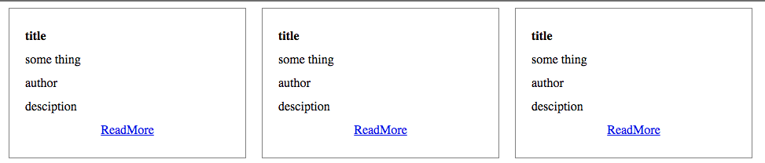

# 等高布局的两种实现方式

- 使用flex布局，并且将始终居于底部的元素的`margin`设置为`auto`
- 使用flex布局，将其他元素与最终元素区分，采用父元素的`justify-content`为`space-between`
- 使用flex布局，通过使用`align-self: flex-end` 进行子元素自身布局(见此解释)[https://beacelee.com/post/div-always-on-bottom.html]

# screenshot

